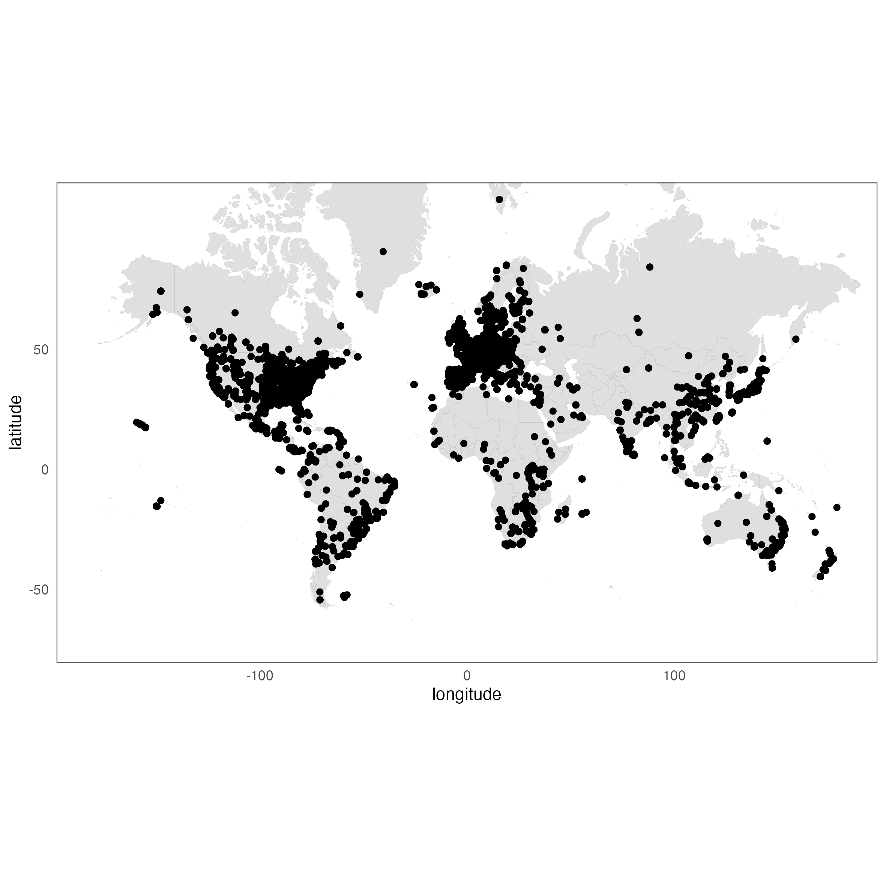
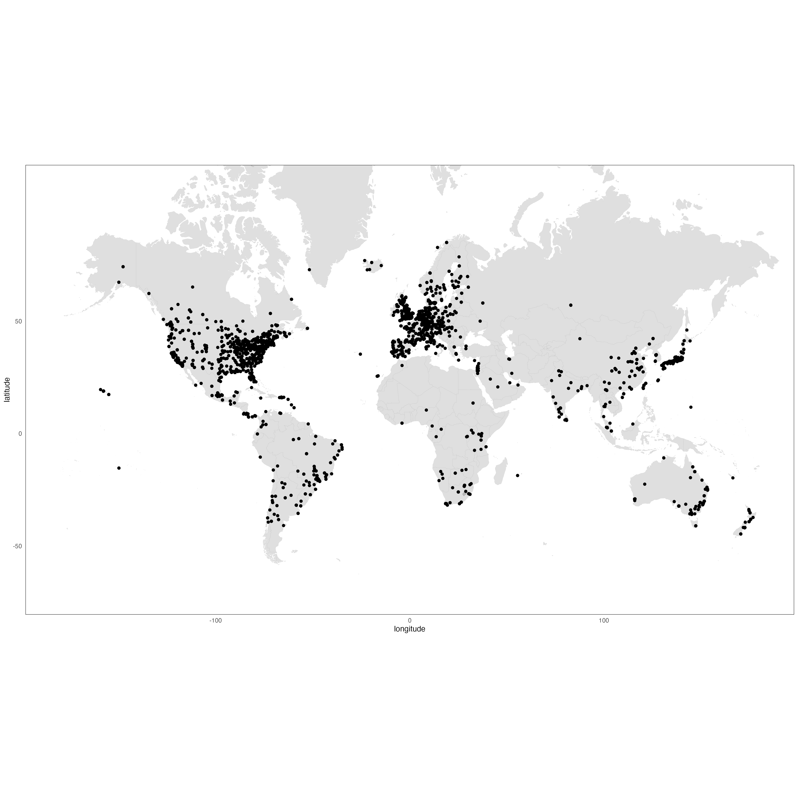
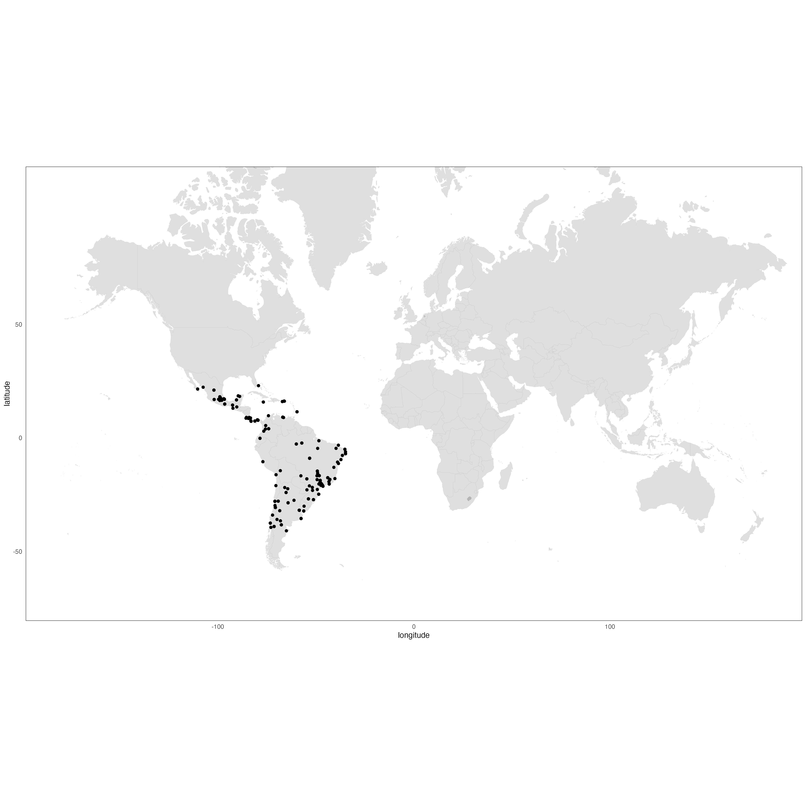
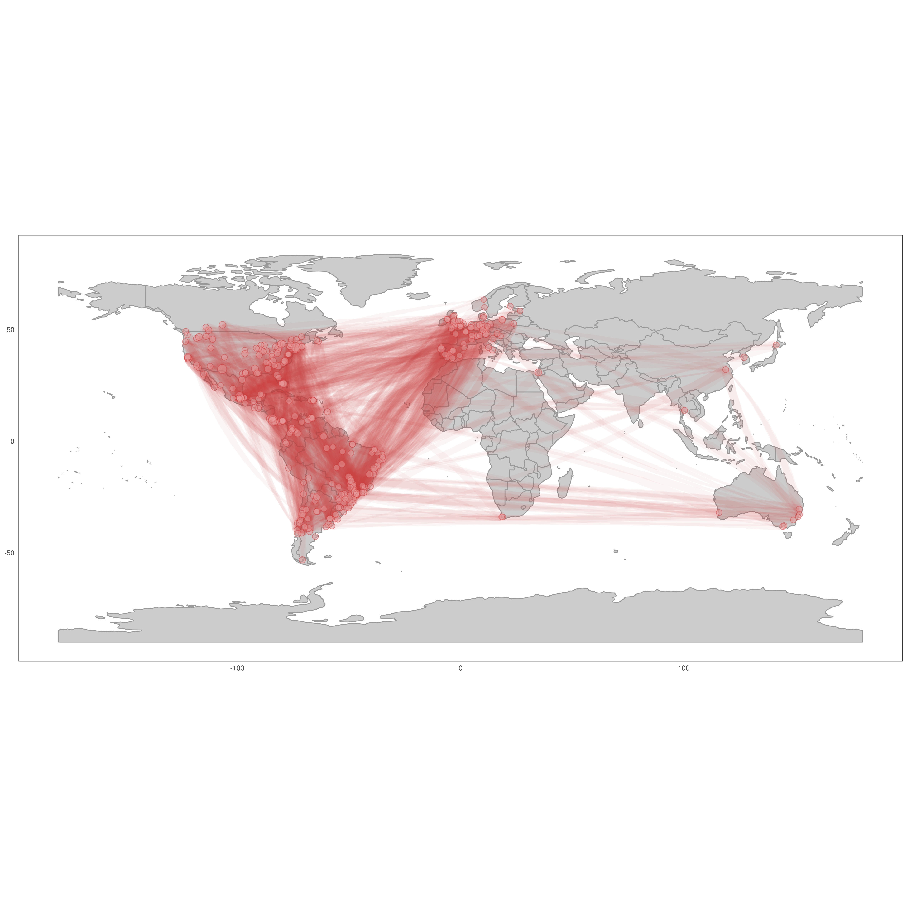
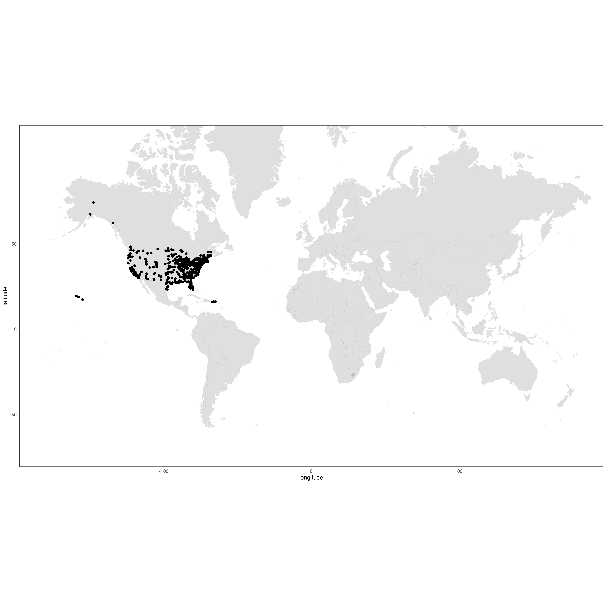
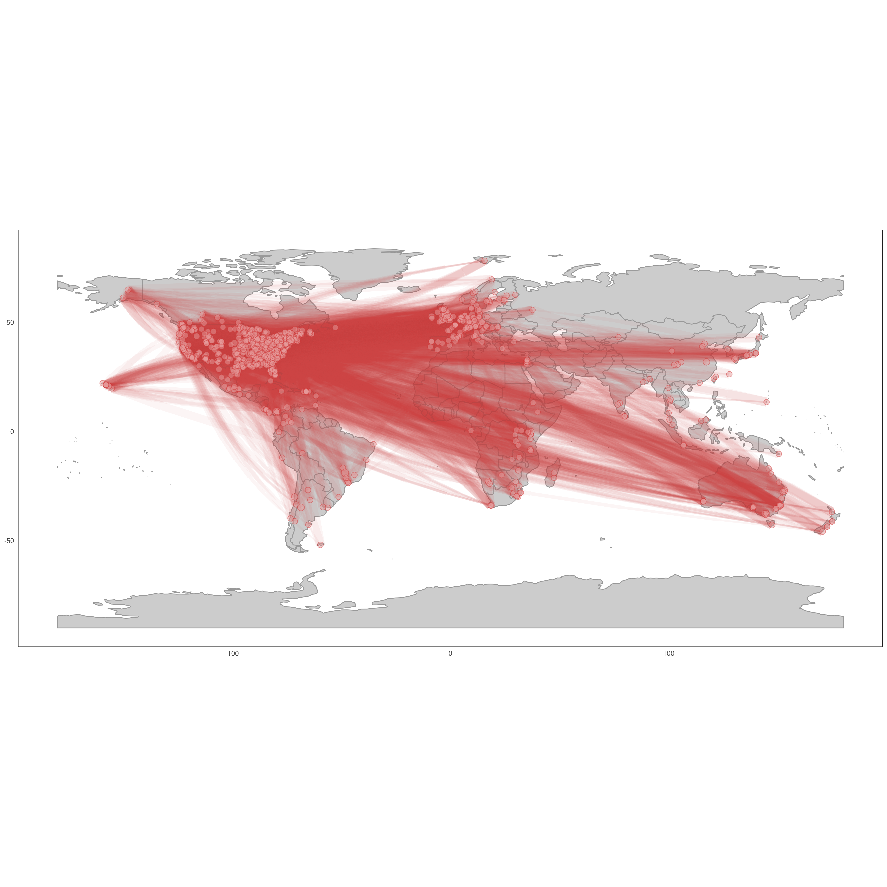

```{r setup, include=FALSE}
knitr::opts_chunk$set(echo = TRUE)
library(tidyverse)
library(refsplitr)
library(kableExtra)
library(RColorBrewer)
```


```{r GlobalOptions, include = FALSE}
options(knitr.duplicate.label = 'allow')
options(knitr.graphics.error = FALSE)  # This allows for the include_graphics to not use the path from root 
knitr::opts_chunk$set(echo = TRUE, fig.align="center")
knitr::opts_chunk$set(fig.pos = "H", out.extra = "")
knitr::opts_chunk$set(tab.pos = "H", out.extra = "")
comma <- function(x) format(x, digits = 2, big.mark = ",") # number formatting
```


## Methods

On June 12, 2025 we downloaded the bibliographic record of every article published in _Animal Behavior_, _Behavioral Ecology_, and _Behavioral Ecology & Sociobiology_ that was indexed in the Web of Science _Core Collection_. These records were then processed and organized using the R package [`refsplitr`](https://docs.ropensci.org/refsplitr/index.html), with which we also disambiguated author names and visualized author locations and coauthorship networks.


Countries were assigned to Global Regions and National Income Categories using the [World Bank categories](https://datahelpdesk.worldbank.org/knowledgebase/articles/906519-world-bank-country-and-lending-groups).   

Data and Code are available on [Github](https://github.com/BrunaLab/anim_behavior).


Fournier, A., M. E. Boone, F. R. Stevens, and E. M. Bruna. 2020. `refsplitr`: Author name disambiguation, author georeferencing, and mapping of coauthorship networks with Web of Science data. _Journal of Open Source Software_, 5(45), 2028, https://doi.org/10.21105/joss.02028


## Results


```{r include = FALSE,echo = FALSE,message = FALSE,warning = FALSE}
 
# geo_referenced publications
all_georef<-read_rds("./data_clean/georef_data_analysis.rds")

# missing authors 

authors_affils<-read_rds("./data_clean/authors_affils_df_clean.rds")

authors_affils<-authors_affils %>% 
  select(-entry_no,-source,-author_url)

authors_affils<-authors_affils %>% 
  mutate(first_middle_initials=gsub("[.]","",first_middle_initials)) %>% 
  unite("author_name",c(surname,first_middle_initials),sep=", ",remove=FALSE) 

authors_affils<-authors_affils %>% 
  group_by(author_name,author_order) %>% 
  slice_head(n=1) %>% 
  mutate(last_name=surname)
```

---


```{r include = FALSE,echo = FALSE,message = FALSE,warning = FALSE}

# papers 
total_pubs_jrnl<-
all_georef %>% 
  select(refID,SO) %>%
  distinct() %>% 
  group_by(SO) %>% 
  tally()


total_pubs<-
all_georef %>% 
  select(refID) %>%
  distinct() %>% 
  tally()

```

### Publications

#### 1. Total No. of Publications _(all journals combined)_: N = `r comma(total_pubs)`   

--- 

#### 2. Publications per Journal

```{r echo = FALSE}
total_pubs_jrnl %>% 
  rename(Journal=SO,
         N=n) %>% 
   kbl() %>%
  # kable_styling() %>% 
  kable_styling(latex_options = "HOLD_position")
```


---


```{r include = FALSE,echo = FALSE,message = FALSE,warning = FALSE}

total_authors<-all_georef %>% 
  select(groupID) %>%
  distinct() %>% 
  tally()

```

### Authors 

#### 1. Total No. of Authors _(all journals combined)_: N = `r comma(total_authors)`

---

#### 2. In which countries are authors based? 

Top N = 20 countries _(all journals combined)_

```{r include = FALSE,echo = FALSE,message = FALSE,warning = FALSE}

# COUNTRY (note - UK countries separate when using country.name but not when
# using country_code)

top_countries<-all_georef %>% 
  # group_by(country.name) %>% 
  group_by(country_code,country_name) %>% 
  filter(!is.na(country_code)) %>% 
  tally() %>% 
  arrange(desc(n)) %>% 
  ungroup() %>% 
  slice(1:20)
top_countries

```


```{r echo = FALSE}
top_countries %>% 
  mutate("Country (ISO code)"=paste(country_name," (",country_code,")")) %>% 
  select(-country_name,-country_code) %>% 
  rename(N=n) %>% 
  select("Country (ISO code)",N) %>% 
   kbl() %>%
  # kable_styling() %>% 
  kable_styling(latex_options = "HOLD_position")
```


```{r include = FALSE,echo = FALSE,message = FALSE,warning = FALSE}

# World Bank Region

all_georef %>% 
  group_by(jrnl,region) %>% 
  # group_by(region) %>% 
  filter(!is.na(region)) %>% 
  tally() %>% 
  mutate(perc=n/sum(n)*100) %>% 
  arrange(desc(n)) %>% 
  arrange(jrnl,desc(perc))


# World Bank Income Category

all_georef %>% 
  # group_by(income_group,jrnl) %>% 
  group_by(income_group) %>% 
  filter(!is.na(income_group)) %>% 
  tally() %>% 
  mutate(perc=n/sum(n)*100) %>% 
  arrange(desc(n))

 # global north vs global south

all_georef %>% 
  group_by(gns) %>% 
  # filter(!is.na(region)) %>% 
  tally() %>% 
  mutate(perc=n/sum(n)*100) %>% 
  arrange(desc(n)) %>% 
  arrange(gns)


# countries within regions

top_countries_by_region_all<-all_georef %>% 
  group_by(region,country_code) %>% 
  # group_by(region) %>% 
  filter(!is.na(region)) %>% 
  tally() %>% 
  mutate(perc=n/sum(n)*100) %>%
  arrange(region,desc(n)) %>% 
  group_by(region) %>% 
  mutate(rank = row_number()) %>% 
  rename(rank_pooled=rank,
         n_pooled=n,
         perc_pooled=perc) %>% 
  relocate(rank_pooled,.before="n_pooled") %>% 
  mutate(country_code=as.factor(country_code)) %>% 
  mutate(perc_pooled=round(perc_pooled,2))
top_countries_by_region_all


top_countries_by_region<-all_georef %>% 
  group_by(region,jrnl,country_code) %>% 
  # group_by(region) %>% 
  filter(!is.na(region)) %>% 
  tally() %>% 
  mutate(perc=n/sum(n)*100) %>%
  arrange(jrnl,region,desc(n)) %>% 
  relocate(jrnl,.before=1) %>% 
  group_by(jrnl,region) %>% 
  mutate(rank = row_number()) %>% 
  mutate(jrnl=as.factor(jrnl),
         country_code=as.factor(country_code)) %>% 
  mutate(perc=round(perc,2))
top_countries_by_region

ab<-top_countries_by_region %>% 
  filter(jrnl=="ab") %>% 
  pivot_wider(names_from = jrnl, values_from = n:perc, values_fill = 0) %>% 
  rename(rank_ab=rank)
ab

be<-top_countries_by_region %>% 
  filter(jrnl=="be") %>% 
  pivot_wider(names_from = jrnl, values_from = n:perc, values_fill = 0) %>% 
  rename(rank_be=rank)

bes<-top_countries_by_region %>% 
  filter(jrnl=="bes") %>% 
  pivot_wider(names_from = jrnl, values_from = n:perc, values_fill = 0) %>% 
  rename(rank_bes=rank)
bes

country_rankings_within_region<-top_countries_by_region_all %>% 
full_join(ab,by=c("region","country_code")) %>% 
  full_join(be,by=c("region","country_code")) %>% 
  full_join(bes,by=c("region","country_code")) 

write_csv(country_rankings_within_region,"./data_clean/country_rankings_within_region.csv")


#  
#   relocate(rank,.before="n")
  
top_countries_by_region<-top_countries_by_region %>% 
pivot_wider(names_from = jrnl, values_from = n:perc, values_fill = 0) %>% 
  relocate(perc_ab,.after="n_ab") %>% 
  relocate(perc_be,.after="n_be") %>% 
  relocate(perc_bes,.after="n_bes")

top_countries_by_region %>% 
arrange(desc(pick(starts_with("n_bes"))))

# plot points -------------------------------------------------------------

# 
# 
# plot_addresses_points <- plot_addresses_points(all_georef)
# plot_addresses_points
# 
# Plot 
# 
# plot_net_address <-plot_net_address(all_georef,
#                                     lineResolution = 10,
#                                     lineAlpha=.1)
# plot_net_address
# 


all_refined<-read_csv("./data_clean/all_refined.csv")


total_authors<-all_refined %>% 
  select(address) %>% 
  tally()
total_authors

addresses_yr<-all_refined %>% 
  select(PY) %>% 
  group_by(PY) %>% 
  tally() %>% 
  arrange(desc(PY)) %>% 
  rename(total_authors=n)
addresses_yr

addresses<-all_refined %>% 
  select(address,PY) %>% 
  group_by(address,PY) %>% 
  tally() %>% 
  filter(address=="Could not be extracted")

addresses_perc<-full_join(addresses,addresses_yr) %>% 
  mutate(perc=n/total_authors*100) %>% 
  arrange(desc(perc))
addresses_perc


all_georef %>% 
  group_by(refID) %>% 
  mutate(latam=(region=="latin america & caribbean")) %>% 
  relocate(latam,.before=1)
  


all_georef %>% 
  group_by(refID) %>% 
  filter(region=="latin america & caribbean")

all_georef %>% 
  group_by(refID) %>% 
  slice_head(n=1) %>% 
  tally() 

# 
#   ggplot(all_georef, aes(x=xValue, y=yValue)) +
#   geom_line()


```


--- 


```{r include = FALSE,echo = FALSE,message = FALSE,warning = FALSE}

collab_pubs<-all_georef %>% 
  group_by(refID, .drop = FALSE) %>%
  count() %>% 
  filter(n>1) %>% 
  select(refID)


all_georef_collab<-all_georef %>% 
  filter(refID %in% collab_pubs$refID)


# all coauthors same region? ----------------------------------------------


all_georef_collab<-all_georef_collab %>% 
  group_by(refID) %>% 
  # mutate(all_same_region = n_distinct(region) == 1) %>% 
  mutate(all_same_region = n_distinct(region[!is.na(region)]) == 1) %>%  # this excludes all with NA in region
  # mutate(all_same_gns = n_distinct(gns) == 1) 
  mutate(all_same_gns = n_distinct(gns[!is.na(gns)]) == 1) # this excludes all with NA in gns


```

### Coauthorhsip Analysis _(Note: Only papers with >1 author)_  


#### 1. Are all co-authors from the same global region as the 1st Author?


```{r include = FALSE,echo = FALSE,message = FALSE,warning = FALSE}
region_coauthors<-
all_georef_collab %>% 
  filter(author_order==1) %>% 
  group_by(region,all_same_region) %>% 
  tally() %>% 
  mutate(perc=n/sum(n)*100) %>% 
  arrange(region,desc(all_same_region)) %>% 
  filter(!is.na(region)) 
```

```{r echo = FALSE}
region_coauthors %>% 
  mutate(perc=round(perc,2)) %>% 
  rename("first author based in..." = region,
         'all coauthors in same region'=all_same_region,
         N=n,
         "%" = perc) %>% 
   kbl() %>%
  # kable_styling() %>% 
  kable_styling(latex_options = "HOLD_position")


ggplot(region_coauthors, 
       aes(x=as.factor(region),
           y=perc,
           fill=as.factor(all_same_region))) +
  geom_bar(stat="identity") +
  scale_fill_brewer(palette = "Set1") +
  theme_bw()+
  xlab("Region")+
  ylab("Percentage")+
  theme(axis.text.x = element_text(angle = 90, vjust = 0.5, hjust=1))+
  theme(legend.position="none")
```


---

#### 2. Where are the coauthors of papers with 1st authors based in the Global North or South?

```{r include = FALSE,echo = FALSE,message = FALSE,warning = FALSE}

gns_coauthors<-
all_georef_collab %>% 
  filter(author_order==1) %>% 
  group_by(gns,all_same_gns) %>% 
  tally() %>% 
  mutate(perc=n/sum(n)*100)

```


```{r echo = FALSE}
gns_coauthors %>% 
  mutate(perc=round(perc,2)) %>% 
  rename("first author based in..." = gns,
         'all coauthors in same'=all_same_gns,
         N=n,
         "%" = perc) %>% 
  # mutate("N (%)"= paste(n," (",perc,")", sep = "")) %>% 
   kbl() %>%
  # kable_styling() %>% 
  kable_styling(latex_options = "HOLD_position")


ggplot(gns_coauthors, 
       aes(x=as.factor(gns),
           y=perc,
           fill=as.factor(all_same_gns))) +
  geom_bar(stat="identity") +
  scale_fill_brewer(palette = "Set1") +
  theme_bw()+
  xlab("Global North or South")+
  ylab("Percentage")+
  # theme(axis.text.x = element_text(angle = 90, vjust = 0.5, hjust=1))+
  theme(legend.position="none")
```

---


#### All author locations 

{width=75%}. 

#### 1st Author Locations 

{width=75%}. 


#### 1st Authors based in Latin America & Caribbean 


{width=75%}

{width=75%}

---

#### 1st Authors based in the USA


{width=75%}

{width=75%}
